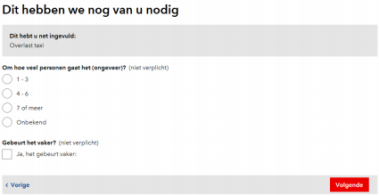
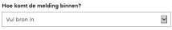

# Handleiding import

**Inhoudsopgave**

**1 Inleiding 5**

**2 Inloggen 6** 2.1 Inloggen ADW \(voor interne medewerkers\) 6 2.2 Inloggen \(voor medewerkers met een extern account\) 6

**3 Een melding maken 7** 3.1 Een melding maken \(extern\) 7 3.1.1 Selecteren van een locatie 7 3.1.2 Bepalen van de categorie 8 3.1.3 Datum/tijd van overlast 8 3.1.4 Foto kiezen 8 3.1.5 Vervolgvragen op basis van subcategorie 9 3.1.6 Contactgegevens 9 3.1.7 Overzicht van de melding 10 3.1.8 Toestemming delen gegevens 10 3.1.9 Bedankt! 10 3.2 Een melding maken \(voor medewerkers\) 11 3.2.1 Bron van binnenkomst registreren 11 3.2.2 Interne melding 12 3.2.3 Type melding 12 3.2.4 Urgentie bepalen 12

**4 Een melding behandelen 13** 4.1 Rollen 13 4.2 Behandelschermen 14 4.2.1 Filters 15 4.2.2 Vrij zoeken 16 4.2.3 Kolommen sorteren 16 4.3 Een melding behandelen 17 4.3.1 Van gemeld naar afgehandeld 17 4.3.2 Details van de melding 17 4.3.3 Status wijzigen 19 4.3.4 Status wijzigen – THOR 20 4.3.5 Status wijzigen – Heropend 21 4.3.6 Splitsen 21 4.3.7 Verzoek tot heropenen 24 4.3.8 Urgentie wijzigen 25 4.3.9 Subcategorie wijzigen 25 4.3.10 Locatie wijzigen 26 4.3.11 Type melding wijzigen 27 4.3.12 Notities 27 4.3.13 Foto 28 4.3.14 Werkbon 28 4.3.15 Een e-mail bericht naar de melder 28

Pagina 3 van 35

Handleiding SIA – Signalen Informatievoorziening Amsterdam

4.3.16 Standaard teksten 29

**5 Tijdelijke werkwijzen 30** 5.1 SMS versturen 30 5.2 Melding doorzetten naar externe partijen 30 5.3 Koppelen van meldingen is nog niet mogelijk 31 5.4 E-mailbericht naar handhaving buiten kantoortijden 31

**6 Ondersteuning 33** IVDesk Dienstverlening en Informatie 33

**7 Bijlage 1 Lijst van e-mailadressen externe partijen 34 8 Bijlage 2 Verantwoordelijke afdelingen 35**

Pagina 4 van 35

Handleiding SIA – Signalen Informatievoorziening Amsterdam

**1 Inleiding**

Dit is de handleiding voor Signalen Informatievoorziening Amsterdam, kortweg SIA. De eerste versie van SIA gaat het proces van meldingen openbare ruimte ondersteunen. Het vervangt daarmee dat gedeelte van de ondersteuning die eerst door KIM MORA geleverd werd.

Deze handleiding kan je gebruiken om jezelf wegwijs te maken in de applicatie binnen de opleidingsomgeving en als naslagwerk voor het werk in productie.

De eerste oplevering van SIA bevat de basisfunctionaliteit om meldingen te ontvangen, registreren en behandelen. Gedurende 2018 \(en mogelijk daarna\) zal SIA uitgebreid worden met nieuwe functionaliteiten. Bij iedere uitbreiding of wijziging van een functionaliteit zal een nieuwe handleiding gepubliceerd worden.

De laatste versie van de handleiding kun je altijd opvragen bij de Servicedesk.

**Ondersteuning of meer informatie nodig?**

Neem contact op met de IVdesk:

• E-mail: 

• Telefoon: 

Bereikbaar op werkdagen tussen 8.00 en 18.00 uur.

**Legenda**

In deze handleiding wordt in sommige gevallen extra aandacht gevraagd **!** Waarschuwing: belangrijk punt van aandacht.

? Tip: aanvullende instructie en/of toelichting

Pagina 5 van 35

Handleiding SIA – Signalen Informatievoorziening Amsterdam

**2 Inloggen**

Inloggen op SIA kan via onderstaande links.

- https://meldingen.amsterdam.nl/login

- https://meldingenweesp.amsterdam.nl/manage/incidents

- https://meldingenamsterdamsebos.amsterdam.nl/manage/incidents De mogelijkheden om in te loggen zijn:

**Figuur 1; Inlogmogelijkheden**

**2.1 Inloggen ADW \(voor interne medewerkers\)**

Als je al in ADW bent ingelogd dan hoef je alleen op de link “Inloggen ADW” te klikken. Je krijgt dan op basis van je huidige ADW inloggegevens toegang tot SIA.

**2.2 Inloggen \(voor medewerkers met een extern account\)** Indien je geen op ADW-account hebt, kan je met je gebruikersnaam en wachtwoord inloggen. 

**Figuur 2; Inloggen als medewerker met speciale bevoegdheid**

Pagina 6 van 35

Handleiding SIA – Signalen Informatievoorziening Amsterdam

**3 Een melding maken**

**3.1 Een melding maken \(extern\)**

Amsterdammers kunnen een Melding Openbare Ruimte en overlast \(ook wel bekend als MORA\) maken via meldingen.amsterdam.nl.

**Figuur 3; Meldingsformulier op amsterdam.nl**

**3.1.1 Selecteren van een locatie**

Het formulier biedt de mogelijkheid om een locatie te kiezen op de kaart of om een adres in te voeren.

Pagina 7 van 35

Handleiding SIA – Signalen Informatievoorziening Amsterdam

**3.1.2 Bepalen van de categorie**

In het nieuwe systeem wordt dit automatisch gedaan op basis van de tekst die de melder invoert.

**3.1.3 Datum/tijd van overlast**

Voor sommige categorieën meldingen is het van belang om te weten of de overlast nu ervaren wordt of dat dit in het verleden was \(met name van belang voor handhaving\). Indien gekozen wordt voor eerder dan kan tot een week terug aangegeven worden op welk moment de overlast of andersoortige misstand ervaren werd:

**Figuur 4; Aangeven tijdstip**

**3.1.4 Foto kiezen**

Het formulier biedt ook de mogelijkheid om drie foto’s toe te voegen.

**Figuur 5; Foto kiezen**

**!** Momenteel is het mogelijk om maximaal 3 bestanden te uploaden.

Pagina 8 van 35

Handleiding SIA – Signalen Informatievoorziening Amsterdam

**3.1.5 Vervolgvragen op basis van subcategorie**

Anders dan in het oude formulier kunnen, na automatische bepalen van de categorie en subcategorie, gerichte vervolgvragen gesteld worden. Zo kan per categorie die specifieke informatie uitgevraagd worden die van belang is voor het opvolgen van dat specifieke type melding, zoals:

**Figuur 6; Voorbeeld vervolgvragen**

**3.1.6 Contactgegevens**

In de volgende stappen in het formulier wordt gevraagd om een telefoonnummer, zodat eventueel contact opgenomen kan worden met de melder indien er iets aan de melding niet duidelijk is. Een e-mailadres wordt gevraagd zodat we de melder een bevestiging van de melding kunnen sturen en per e-mail op de hoogte kunnen houden van de voortgang van het opvolgen van de melding:

**Figuur 7; Invoerveld e-mailadres**

Het is niet verplicht om contactgegevens op te geven. Indien de melder ervoor kiest om dit wel te doen dan zullen de persoonsgegevens twee weken na het afronden van de melding worden verwijderd in verband met de privacy wetgeving.

Pagina 9 van 35

Handleiding SIA – Signalen Informatievoorziening Amsterdam

**3.1.7 Overzicht van de melding**

Na de invoer van de benodigde gegevens krijgt de melder een overzicht van de melding te zien en kan de melder de gegevens indien gewenst nog wijzigen:

**Figuur 8; Overzicht van de melding**

**3.1.8 Toestemming delen gegevens**

De burger kan toestemming geven voor het delen van de gegevens met andere organisaties. De gegevens worden alleen door de gemeente gedeeld wanneer dit nodig is om de melding op te lossen.

**3.1.9 Bedankt!**

In de laatste stap komt de melder op de zogenoemde bedankt-pagina. Hier wordt ook verteld op welke manier en wanneer we de melding zullen opvolgen:

Pagina 10 van 35

Handleiding SIA – Signalen Informatievoorziening Amsterdam 

**Figuur 9; Bedankt-pagina**

**3.2 Een melding maken \(voor medewerkers\)**

Voor medewerkers die namens Amsterdammers een melding openbare ruimte invoeren is een intern meldformulier beschikbaar. Dit werkt precies hetzelfde als het publieke formulier, behalve dat er gevraagd wordt om de bron van de melding \(14 020, Webcare, etc.\), het type melding en de urgentie.:

**3.2.1 Bron van binnenkomst registreren**

Geef hierbij aan via welke bron de melding binnenkomt.

**Figuur 10; Bron van binnenkomst**

De volgende bronnen zijn beschikbaar:

- Telefoon – CCA

- Telefoon – ASC

- Telefoon – Interswitch

- Telefoon – Stadsdeel

- Telefoon – Adoptant

- E-mail – CCA

- E-mail – ASC

- E-mail – Stadsdeel

- Webcare – CCA

- Interne melding

- Meldkamer burger/ondernemer

- Meldkamer Handhaver

- Meldkamer Politie

- VerbeterDeBuurt

- Waarnemingenapp

Pagina 11 van 35

Handleiding SIA – Signalen Informatievoorziening Amsterdam

**3.2.2 Interne melding**

Wanneer bij een melding een @amsterdam.nl adres wordt opgegeven bij de contactgegevens, zal een melding **altijd** als Interne melding worden geregistreerd.

**3.2.3 Type melding**

**Figuur 31; Type melding bepalen**

**Melding**

Een verzoek tot herstel of handhaving om de normale situatie te herstellen \(container vol, geluidsoverlast, te hard varen, etc\).

**Aanvraag**

Een verzoek om iets structureels te veranderen \(plaatsing bankje, verplaatsen container, etc\).

**Vraag**

Een verzoek om informatie \(van wie is die camera, waarom zijn de paaltjes weggehaald, etc\).

**Klacht**

Een uiting van ongenoegen over het handelen van de gemeente.

**Groot onderhoud**

Een verzoek dat niet onder dagelijks beheer valt, maar onder een langdurig traject.

**3.2.4 Urgentie bepalen**

Bij spoedeisende en/of gevaarlijke situaties kan de urgentie van de melding verhoogd worden naar Hoog. Ook kan de urgentie op Laag worden gezet.

**Figuur 11; Urgentie bepalen**

Pagina 12 van 35

Handleiding SIA – Signalen Informatievoorziening Amsterdam

**4 Een melding behandelen**

**4.1 Rollen**

Binnen SIA zijn momenteel de volgende rollen aangemaakt:

**Monitor**

De monitor kan meldingen aanmaken en bekijken. Het behandelen van meldingen kan door deze rol niet worden uitgevoerd.

**Extern Systeem**

We hebben koppelingen met diversie externe systemen. Deze kunnen een melding bekijken, aanmaken en behandelen.

**Behandelaar**

Een behandelaar kan meldingen bekijken, afhandelen en splitsen.

**Coördinator**

Een coördinator kan meldingen bekijken, wijzigen en afhandelen.

**Regievoerder**

Een regievoerder heeft voornamelijk een plaats binnen het Actie Service Centrum. De

regievoerder kan meldingen bekijken, wijzigen en afhandelen van vrijwel alle diensten.

**Regievoerder+**

Met deze rol heb je naast alle “Regievoerder” rechten ook de rechten om standaard afmeldteksten binnen SIA toe te voegen.

<table>
  <thead>
    <tr>
      <th style="text-align:left">Rol</th>
      <th style="text-align:left">
        
r

        
o

        
t

        
i

        
n

        
o

        
M

      </th>
      <th style="text-align:left">
        
m

        
e

        
e

        
t

        
s

        
y

        
S

        
n

        
r

        
e

        
t

        
x

        
E

      </th>
      <th style="text-align:left">
        
r

        
a

        
a

        
l

        
e

        
d

        
n

        
a

        
h

        
e

        
B

      </th>
      <th style="text-align:left">
        
r

        
o

        
t

        
a

        
n

        
i

        
d

        
r

        
&#xF6;

        
o

        
C

      </th>
      <th style="text-align:left">
        
r

        
e

        
d

        
r

        
e

        
o

        
v

        
e

        
i

        
g

        
e

        
R

      </th>
      <th style="text-align:left">
        
+

        
r

        
e

        
d

        
r

        
e

        
o

        
v

        
e

        
i

        
g

        
e

        
R

      </th>
    </tr>
  </thead>
  <tbody>
    <tr>
      <td style="text-align:left">Melding aanmaken</td>
      <td style="text-align:left">x</td>
      <td style="text-align:left">x</td>
      <td style="text-align:left">x</td>
      <td style="text-align:left">x</td>
      <td style="text-align:left">x</td>
      <td style="text-align:left">x</td>
    </tr>
    <tr>
      <td style="text-align:left">Melding bekijken</td>
      <td style="text-align:left">x</td>
      <td style="text-align:left">x</td>
      <td style="text-align:left">x</td>
      <td style="text-align:left">x</td>
      <td style="text-align:left">x</td>
      <td style="text-align:left">x</td>
    </tr>
    <tr>
      <td style="text-align:left">Notities bekijken / toevoegen</td>
      <td style="text-align:left">x</td>
      <td style="text-align:left">x</td>
      <td style="text-align:left">x</td>
      <td style="text-align:left">x</td>
      <td style="text-align:left">x</td>
      <td style="text-align:left">x</td>
    </tr>
    <tr>
      <td style="text-align:left">Urgentie wijzigen</td>
      <td style="text-align:left">x</td>
      <td style="text-align:left">x</td>
      <td style="text-align:left">x</td>
      <td style="text-align:left">x</td>
      <td style="text-align:left">x</td>
      <td style="text-align:left">x</td>
    </tr>
    <tr>
      <td style="text-align:left">Status wijzigen</td>
      <td style="text-align:left"></td>
      <td style="text-align:left">x</td>
      <td style="text-align:left">x</td>
      <td style="text-align:left">x</td>
      <td style="text-align:left">x</td>
      <td style="text-align:left">x</td>
    </tr>
    <tr>
      <td style="text-align:left">Melding splitsen</td>
      <td style="text-align:left"></td>
      <td style="text-align:left"></td>
      <td style="text-align:left">x</td>
      <td style="text-align:left">x</td>
      <td style="text-align:left">x</td>
      <td style="text-align:left">x</td>
    </tr>
    <tr>
      <td style="text-align:left">Categorie wijzigen</td>
      <td style="text-align:left"></td>
      <td style="text-align:left"></td>
      <td style="text-align:left"></td>
      <td style="text-align:left">x</td>
      <td style="text-align:left">x</td>
      <td style="text-align:left">x</td>
    </tr>
    <tr>
      <td style="text-align:left">Doorzetten naar THOR</td>
      <td style="text-align:left"></td>
      <td style="text-align:left"></td>
      <td style="text-align:left"></td>
      <td style="text-align:left"></td>
      <td style="text-align:left">x</td>
      <td style="text-align:left">x</td>
    </tr>
    <tr>
      <td style="text-align:left">Standaardteksten bewerken</td>
      <td style="text-align:left"></td>
      <td style="text-align:left"></td>
      <td style="text-align:left"></td>
      <td style="text-align:left"></td>
      <td style="text-align:left"></td>
      <td style="text-align:left">x</td>
    </tr>
  </tbody>
</table>

**Figuur 28; Overzicht rollen**

Pagina 13 van 35

Handleiding SIA – Signalen Informatievoorziening Amsterdam

**4.2 Behandelschermen**

Via het tabblad “Afhandelen” kom je in het overzichtsscherm van af te handelen meldingen. **Figuur 12; Overzicht meldingen**

Naast de lijstweergave is ook de kaartweergave mogelijk. Hier zie je alle meldingen van de afgelopen 24uur op de kaart. Door op een marker te klikken kan je de desbetreffende melding openen.

**Figuur 35; Overzicht meldingen op de kaart**

Pagina 14 van 35

Handleiding SIA – Signalen Informatievoorziening Amsterdam

**4.2.1 Filters**

Je kan je eigen filters aanmaken en opslaan. Ga hiervoor naar ‘Filteren’, geef je filter een naam, selecteer de gewenste onderdelen en kies voor ‘Opslaan en filteren’. Hierna worden in het meldingenscherm de meldingen weergegeven binnen het opgegeven filter.

**Figuur 29; Overzicht filterscherm**

**!** Wanneer je bij een bepaald filteronderdeel geen selectie hebt gemaakt, wordt alles getoond.

**!** Je maakt een nieuw filter aan door in het filterscherm linksonder op ‘Nieuw filter’ te klikken.

Je kan op de volgende onderdelen filteren;

- **Id;** het nummer van de melding

- **Datum;** de datum \(of datumrange\) waarop de melding is binnengekomen - **Zoeken in notities;** zoek op tekst in het notitieveld van een melding

- **Type;** het type melding

- **Urgentie;** laag, normaal of hoog

- **Stadsdeel;** het verantwoordelijke stadsdeel

- **Subcategorie;** de subcategorie van de melding. Zie bijlage 3 voor een overzicht - **Adres;** de locatie die is doorgegeven door de melder

- **Contactgegevens;** Telefoon, e-mailadres, of geen contactgegevens

- **Feedback;** de feedback van de burger

- **Bron;** het kanaal waarop de melding is binnen gekomen

Pagina 15 van 35

Handleiding SIA – Signalen Informatievoorziening Amsterdam

- **Status;**

- Gemeld

- In afwachting van behandeling

- In behandeling

- Ingepland

- Afgehandeld

- Geannuleerd

- Heropend

- Extern: te verzenden

- Extern: verzonden

- Extern: mislukt

- Extern: afgehandeld

- Extern: verzoek tot afhandelen

- Gesplitst

- Verzoek tot heropenen

**!** De statussen die beginnen met “Extern:” zijn alleen van toepassing als een melding automatisch wordt doorgestuurd naar een externe partij

Je opgeslagen filters kan je terug vinden onder ‘Mijn filters’.

Vanuit dit scherm kan je naar het resultaat van het filter, het filter aanpassen of deze verwijderen. **Figuur 31; Mijn filters**

**4.2.2 Vrij zoeken**

Via de zoekbalk bovenaan je scherm kan je vrij zoeken naar meldingen. Op dit moment wordt er gezocht binnen de omschrijving, het meldingsnummer, e-mail, telefoonnummer en de subcategorie.

**Figuur 30; Vrij zoeken**

**4.2.3 Kolommen sorteren**

Door op de titel van de kolom te klikken kan je de sortering op- of aflopend instellen. Je kan op alle kolommen sorteren.

Pagina 16 van 35

Handleiding SIA – Signalen Informatievoorziening Amsterdam

**4.3 Een melding behandelen**

**4.3.1 Van gemeld naar afgehandeld**

Een melding wordt op hoofdlijnen volgens een bepaald proces afgehandeld. Dit proces staat schematisch weergegeven in onderstaand figuur.

**Figuur 13; Schematische weergave behandelproces**

**4.3.2 Details van de melding**

Door op een specifieke melding te klikken in de lijst worden de details van de melding weergegeven:

Pagina 17 van 35

Handleiding SIA – Signalen Informatievoorziening Amsterdam

**Figuur 14; Details van de melding**

Het overzicht toont:

- het meldingsnummer \(bovenaan\)

- de locatie van de melding op de kaart \(links\)

- details van de melding \(links\)

- de status, hoofd- en subcategorie, urgentie, type melding en verantwoordelijke afdeling \(rechts\)

- de historie van de melding \(onderaan\)

**Figuur 15; Historie van de melding**

Pagina 18 van 35

Handleiding SIA – Signalen Informatievoorziening Amsterdam

**4.3.3 Status wijzigen**

**Figuur 16; Tabblad Status**

Bij een melding kan een status toegevoegd worden. SIA kent momenteel de volgende statussen waar je als gebruiker voor kan kiezen:

- Gemeld

- In afwachting van behandeling

- In behandeling

- Ingepland

_De melder ontvangt deze toelichting per e-mail._

- Afgehandeld

_De melder ontvangt deze toelichting per e-mail. Verwijs nooit naar een andere afdeling; hercategoriseer dan de melding. Gebruik deze status alleen als de melding ook echt is afgehandeld, gebruik anders de status Ingepland. Let op: als de huidige status “Verzoek tot heropenen” is, dan wordt er geen e-mail naar de melder gestuurd._

- Extern: Verzoek tot afhandeling

- Geannuleerd

_Bij deze status wordt de melding geannuleerd. Gebruik deze status alleen voor test- en nepmeldingen of meldingen van veelmelders._

- Heropend

_De melding wordt heropend. Verwijs nooit naar een andere afdeling; hercategoriseer dan de melding._

De statussen Ingepland, Afgehandeld en Heropend sturen **altijd** een toelichting naar de melder. Bij de overige statussen is het mogelijk om de toelichting naar de melder te sturen. Dit doe je door de checkbox aan te vinken.

Pagina 19 van 35

Handleiding SIA – Signalen Informatievoorziening Amsterdam

**Figuur32; Sturen van de toelichting aan de melder**

Bij het toevoegen van een status is het verplicht om aan te geven wat er met de melding gedaan is waardoor deze van status is veranderd:

Een toegevoegde status verschijnt in het overzicht en zo is de gehele behandeling van een melding inzichtelijk. Indien de melding de status “afgehandeld” heeft bereikt dan is alleen de status “heropend” mogelijk.

**!** Let op de schrijfstijl, de e-mail bevat al een aanhef en afsluiting. **!**

**4.3.4 Status wijzigen – THOR**

Het doorsturen van meldingen naar Toezicht en Handhaving Openbare Ruimte \(THOR\) kan via de speciale doorstuurknop.

**!** Deze functie is alleen beschikbaar voor de rol Regievoerder. Dit zijn de medewerkers van het Actie Service Centrum \(ASC\).

Wanneer je een melding tegenkomt die moet worden doorgezet naar handhaving, dan kan je de subcategorie aanpassen naar een van de hoofdcategorie “Overlast van en door personen”. Het ASC zal deze melding dan verder oppakken.

Pagina 20 van 35

Handleiding SIA – Signalen Informatievoorziening Amsterdam

**Figuur 17; Doorsturen naar THOR**

Als een melding naar THOR wordt doorgestuurd dan zijn de volgende statussen mogelijk:

**Te verzenden naar extern systeem**

De melding staat klaar om verzonden te worden. Je kan de melding nu niet meer wijzigen Verzonden naar extern systeem

**De melding is succesvol ontvangen**

De melding kan niet gewijzigd worden totdat THOR de melding heeft afgehandeld.

**Verzending naar extern systeem mislukt**

De melding is niet ontvangen door THOR. Je kan het opnieuw proberen.

**Melding is afgehandeld in extern systeem**

De melding is afgehandeld door THOR. Je kan nu de melding verder afhandelen.

**4.3.5 Status wijzigen – Heropend**

Een melding kan heropend worden indien deze nog niet correct is afgehandeld. Wanneer een melding wordt heropend kan deze weer behandeld worden. Bij het heropenen van een melding wordt er een bericht naar de melder gestuurd indien er een e-mailadres is achtergelaten.

**4.3.6 Splitsen**

Een melding kan worden gesplitst in twee of drie deelmeldingen. Je kan de melding alleen splitsen wanneer deze op “Gemeld” staat.

**Figuur 24; Knop splitsen**

Pagina 21 van 35

Handleiding SIA – Signalen Informatievoorziening Amsterdam

Bij het splitsen van een melding geef je per nieuwe melding aan wat de subcategorie is en kan je de omschrijving aanpassen, een notitie toevoegen, de urgentie aangeven en de foto’s toevoegen. Wanneer een melding is gesplitst kan deze niet meer behandeld worden.

**!** Splitsen mag alleen als de oorspronkelijke melding over twee

**!**

verschillende onderwerpen gaat, die zonder samenwerking met een andere afdeling kan worden afgehandeld.

Pagina 22 van 35

Handleiding SIA – Signalen Informatievoorziening Amsterdam

**Figuur 25; Splits scherm**

Pagina 23 van 35

Handleiding SIA – Signalen Informatievoorziening Amsterdam

De melder ontvangt een mail met het bericht dat de oorspronkelijke melding gesplitst is evenals de nieuwe meldingsnummers met bijbehorende subcategorie.

**!** LET OP: zitten er meerdere foto’s bij de melding?

Wanneer je een melding splitst, worden alle \(of geen\) foto’s in de nieuwe deelmeldingen toegevoegd.

Wanneer een melding gesplitst is, kan je in de originele melding de gesplitste meldingen en huidige statussen terugvinden.

**Figuur 34; Een gesplitste melding**

**4.3.7 Verzoek tot heropenen**

Wanneer een melding de status “Afgehandeld” krijgt én de melder een mailadres heeft opgegeven, ontvangt deze automatisch een afmeldbericht. Daarin wordt ook de toelichtingstekst getoond die de behandelaar heeft ingetypt bij deze status.

In het afmeldbericht heeft de melder de functie om aan te geven of hij/zij tevreden is of niet met de oplossing. Als de melder kiest voor een van de onderstaande opties wordt de melding automatisch op “Verzoek tot heropenen gezet.

- _Ik voel mij niet serieus genomen door de gemeente_

- _Er is niets met mijn melding gedaan_

- _Ik heb onvoldoende / onjuiste informatie gekregen_

- _De oplossing volstaat niet, mijn melding is niet opgelost._

- _Anders, namelijk;_

Pagina 24 van 35

Handleiding SIA – Signalen Informatievoorziening Amsterdam

Een melding die is afgesloten kan door een behandelaar worden “Heropend”, als gevolg van feedback, maar ook op basis van een eigen evaluatie.

**!** Let op: bij het opslaan van deze status gaat er automatisch een e-mailbericht daarover naar de melder. Zorg daarom voor een nette, duidelijke toelichting bij deze status.

Als je niets doet met een melding die de status “Verzoek tot heropenen” heeft, krijgt de melder geen enkel bericht na het insturen van de feedback. Als je besluit een melding niet opnieuw in behandeling te nemen, dan kan je een melding gewoon op de status “Verzoek tot heropenen” laten staan: dit is een eindstatus.

Voor het vergroten van het overzicht van reeds bekeken verzoeken kunnen meldingen met

de status “Verzoek tot heropenen” gelijk op de status “Afgehandeld” gezet worden als **!**

duidelijk is dat er niets meer aan de melding te doen is. In dit geval wordt er géén mail naar de melder gestuurd. Alleen als de melding heropend wordt en daarna \(eventueel met enkele tussenstatussen\) op “Afgehandeld” wordt gezet zal er **WEL** een mail gestuurd worden.

**4.3.8 Urgentie wijzigen**

Als een melding meer urgentie nodig heeft, dan kan dit gedaan worden door de urgentie te wijzigen naar Hoog.

**Figuur 18; Tabblad Urgentie**

**4.3.9 Subcategorie wijzigen**

Daarnaast is het mogelijk om van een niet of verkeerd gecategoriseerde melding de categorie te wijzigen.

Pagina 25 van 35

Handleiding SIA – Signalen Informatievoorziening Amsterdam

**Figuur 19; Tabblad Subcategorie**

Door het wijzigen van de categorie verschijnt een melding mogelijk niet meer in de eigen filter en juist wel in de filter van een andere behandelende dienst.

Meldingen die niet met voldoende zekerheid gecategoriseerd kunnen worden krijgen de categorie ‘Overig’.

?_Bijvoorbeeld: door automatische categorisatie is bepaald dat een melding “veeg- / zwerfvuil”_

_betreft, de melding verschijnt in de filter van reiniging. Na nadere lezing van de melding blijkt dat het gaat om “grofvuil”. Na wijziging van de categorie verdwijnt de melding uit de filter van reiniging en verschijnt de melding in de filter van inzameling._

**!** LET OP: na het aanpassen van de subcategorie krijgt de melding weer de status ‘Gemeld’.

**4.3.10 Locatie wijzigen**

Het is ook mogelijk om de locatie van een melding te wijzigen.

**Figuur 26; Tabblad Locatie**

Je wijzigt de locatie van een melding door een punt op de kaart te kiezen of het adres handmatig in te voeren.

Bij de Historie van de melding kan je de wijzigingen van de locatie terugvinden.

Pagina 26 van 35

Handleiding SIA – Signalen Informatievoorziening Amsterdam

**4.3.11 Type melding wijzigen**

Meldingen aangemaakt door burgers komen standaard als Melding binnen. Je kan het type melding wijzigen wanneer het om iets anders gaat dan een melding.

**Figuur 33; Tabblad Type melding**

**4.3.12 Notities**

Via de knop “Notitie toevoegen” kan je een notitie toevoegen aan de melding.

- Notities kunnen door iedereen toegevoegd en geraadpleegd worden.

- De notities zijn terug te vinden onder de Historie

**Figuur 20; Toevoegen notitie**

Pagina 27 van 35

Handleiding SIA – Signalen Informatievoorziening Amsterdam

**4.3.13 Foto**

Wanneer er foto’s zijn geüpload, zie je deze gelijk in het detailscherm van de melding staan. **Figuur 21; Toegevoegde foto’s**

**4.3.14 Werkbon**

Van een melding kan een PDF gemaakt worden zodat deze als werkbon geprint of gemaild kan worden. In het detailscherm van de melding kan via de knop “PDF” de PDF gegenereerd worden.

**Figuur 22; Knop PDF**

? Ga naar hoofdstuk 5.2 om je printerinstellingen aan te passen.

**4.3.15 Een e-mail bericht naar de melder**

Een e-mail bericht naar de melder wordt verstuurd als aan de volgende voorwaarden is voldaan: - De melder heeft een e-mailadres achter gelaten

Pagina 28 van 35

Handleiding SIA – Signalen Informatievoorziening Amsterdam

- De melding heeft de status “afgehandeld”, “heropend” of “ingepland” of de checkbox “Toelichting versturen melder” is aangevinkt

De mail is momenteel nog simpel van opmaak.

**4.3.16 Standaard teksten**

Per subcategorie en status zullen er standaard teksten beschikbaar worden gemaakt. **Figuur 27; Standaardteksten**

Pagina 29 van 35

Handleiding SIA – Signalen Informatievoorziening Amsterdam

**5 Tijdelijke werkwijzen**

Omdat SIA op dit moment vooral nog de basisfunctionaliteit bevat, zijn sommige functies die beschikbaar waren in KIM/MORA nog niet beschikbaar in SIA.

**5.1 SMS versturen**

Het is vanuit SIA niet mogelijk om een SMS te versturen ter bevestiging van de melding aan de melder. Onderzocht wordt in welke mate melders hieraan hechten en of dit een kanaal is dat de gemeente wil blijven gebruiken.

**5.2 Melding doorzetten naar externe partijen**

Het is vanuit SIA nog niet mogelijk om een melding automatisch via e-mail door te zetten naar een externe partij ten behoeve van opvolging van de melding. Om een melding door te zetten zal voor de komende tijd gebruik gemaakt moeten worden van de eigen mail.

- Ga naar het detailscherm van de melding \(zie 4.3\)

- Volg de instructies voor het printen van een werkbon \(zie 4.5\)

- Sla de PDF op op de gewenste locatie

- Open de e-mail cliënt en voeg zelf het PDF bestand bij de e-mail

Een lijst van e-mailadressen van externe partijen is beschikbaar in bijlage 1 van deze handleiding.

Maak na het versturen van de mail altijd handmatig een aantekening in SIA. Dit kan door een opmerking toe te voegen aan een status of door een notitie toe te voegen.

**Figuur 23; Extra opmerking toevoegen aan status**

Pagina 30 van 35

Handleiding SIA – Signalen Informatievoorziening Amsterdam

**5.3 Koppelen van meldingen is nog niet mogelijk**

Voor dubbele meldingen kan via de notities extra informatie over de andere meldingen worden toegevoegd, zoals het melding nummer en extra informatie vanuit die melding.

**5.4 E-mailbericht naar handhaving buiten kantoortijden**

