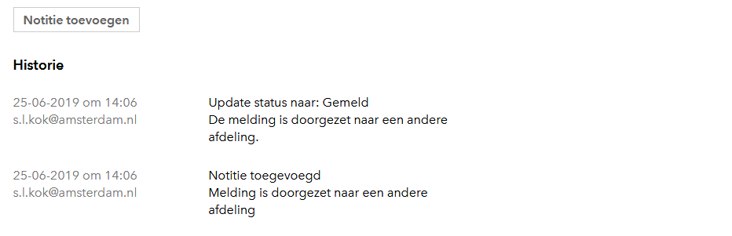

# Untitled

Handleiding SIA

_Signalen Informatievoorziening Amsterdam_

Status: versie 4.2.1

Datum: 11-11-2020

Nieuwste versie? Mail naar [ivdesk@amsterdam.nl](mailto:ivdesk@amsterdam.nl)

**Wijzigingen**

<table>
  <thead>
    <tr>
      <th style="text-align:left"><b>Datum</b>
      </th>
      <th style="text-align:left"><b>Versie</b>
      </th>
      <th style="text-align:left"><b>Wijziging</b>
      </th>
    </tr>
  </thead>
  <tbody>
    <tr>
      <td style="text-align:left">03-10-2018</td>
      <td style="text-align:left">1.4</td>
      <td style="text-align:left">
        
- Hoofdstuk 3; Schermafbeeldingen vernieuwd

        
- Hoofdstuk 3; Bron Telefoon &#x2013; Adoptant toegevoegd

        
- Hoofdstuk 3; Urgentie toegevoegd

        
- Hoofdstuk 4; Schermafbeeldingen vernieuwd

        
- Hoofdstuk 4.1; Autorisatiematrix toegevoegd

        
- Hoofdstuk 4.2; Filter aangepast

        
- Bijlage 3; Categorie&#xEB;n aangepast

        
- Bijlage 1; Lijst met e-mailadressen aangepast

      </td>
    </tr>
    <tr>
      <td style="text-align:left">16-10-2018</td>
      <td style="text-align:left">1.5</td>
      <td style="text-align:left">
        
- Hoofdstuk 1; Legenda toegevoegd

        
- Hoofdstuk 4.1; Autorisatiematrix aangepast

        
- Hoofdstuk 4.3.3; Status wijzigen &#x2013; THOR toegevoegd

        
- Hoofdstuk 4.3.4; Tabel statusovergangen toegevoegd

        
- Hoofdstuk 5.2; Afbeelding aangepast

        
- Bijlage 1; Emailadres politie aangepast

        
- Bijlage 2; Overzicht uitgebreid met service beloften

        
- Bijlage 3; Verwijderd

      </td>
    </tr>
    <tr>
      <td style="text-align:left">13-12-2018</td>
      <td style="text-align:left">1.6</td>
      <td style="text-align:left">
        
- Hoofdstuk 4.1; Autorisatiematrix aangepast

        
- Hoofdstuk 4.2.2; Sorteren kolommen toegevoegd

        
- Hoofdstuk 4.3.8; Notities toegevoegd

        
- Hoofdstuk 4.3.4; Status wijzigen &#x2013; heropend toegevoegd

      </td>
    </tr>
    <tr>
      <td style="text-align:left">05-03-2019</td>
      <td style="text-align:left">1.7</td>
      <td style="text-align:left">- Hoofdstuk 4.3.5; Splitsen toegevoegd</td>
    </tr>
    <tr>
      <td style="text-align:left">26-03-2019</td>
      <td style="text-align:left">1.8</td>
      <td style="text-align:left">- Hoofdstuk 4.3.9; Locatie wijzigen toegevoegd</td>
    </tr>
    <tr>
      <td style="text-align:left">25-4-2019</td>
      <td style="text-align:left">1.9</td>
      <td style="text-align:left">
        
- Hoofdstuk 4.3.6;Tabel statusovergangen aangepast

        
- Bijlage 3; Categorie&#xEB;n en servicebeloften aangepast

      </td>
    </tr>
    <tr>
      <td style="text-align:left">02-05-2019</td>
      <td style="text-align:left">1.10</td>
      <td style="text-align:left">- Hoofdstuk 4.3.14; Tabblad Historie toegevoegd</td>
    </tr>
    <tr>
      <td style="text-align:left">27-05-2019</td>
      <td style="text-align:left">2.0</td>
      <td style="text-align:left">
        
- Hoofdstuk 3.2.1; Bron Verbeter de buurt toegevoegd

        
- Hoofdstuk 4.2.1; Statussen gewijzigd

        
- Hoofdstuk 4.3.3; Statussen gewijzigd

        
- Hoofdstuk 4.3.7; Tabel statusovergangen aangepast

        
- Hoofdstuk 4.3.9; Statusovergangen aangepast

      </td>
    </tr>
    <tr>
      <td style="text-align:left">26-6-2019</td>
      <td style="text-align:left">2.1</td>
      <td style="text-align:left">
        
- Hoofdstuk 3.2.1; Bron Waarnemingenapp toegevoegd

        
- Hoofdstuk 4.3.15; Standaard teksten toegevoegd

        
- Hoofdstuk 4.3.7; Tabel statusovergangen aangepast

      </td>
    </tr>
    <tr>
      <td style="text-align:left">08-07-2019</td>
      <td style="text-align:left">2.2</td>
      <td style="text-align:left">- Hoofdstuk 4.3.3; Status wijzigen aangepast</td>
    </tr>
    <tr>
      <td style="text-align:left">23-09-2019</td>
      <td style="text-align:left">3.0</td>
      <td style="text-align:left">- Hoofdstuk 4.2.1; Filters vernieuwd</td>
    </tr>
    <tr>
      <td style="text-align:left">26-09-2019</td>
      <td style="text-align:left">3.1</td>
      <td style="text-align:left">- Aantal kleine wijzigingen</td>
    </tr>
    <tr>
      <td style="text-align:left">14-10-2019</td>
      <td style="text-align:left">3.2</td>
      <td style="text-align:left">
        
- Hoofdstuk 4.3.7; Verzoek tot heropenen toegevoegd

        
- Bijlage 3 verwijderd; apart document van gemaakt

      </td>
    </tr>
    <tr>
      <td style="text-align:left">18-11-2019</td>
      <td style="text-align:left">3.3</td>
      <td style="text-align:left">- Hoofdstuk 4.1; Autorisatiematrix aangepast</td>
    </tr>
    <tr>
      <td style="text-align:left">6-1-2020</td>
      <td style="text-align:left">3.4</td>
      <td style="text-align:left">- Hoofdstuk 4.2.2; Vrij zoeken toegevoegd</td>
    </tr>
    <tr>
      <td style="text-align:left">5-3-2020</td>
      <td style="text-align:left">3.5</td>
      <td style="text-align:left">
        
- Hoofdstuk 4.2.2; Aangepast

        
- Hoofdstuk 4.2.1; Aangepast

      </td>
    </tr>
    <tr>
      <td style="text-align:left">10-9-2020</td>
      <td style="text-align:left">4.0</td>
      <td style="text-align:left">Handleiding ge&#xFC;pdatet met de laatste features</td>
    </tr>
    <tr>
      <td style="text-align:left">17-9-2020</td>
      <td style="text-align:left">4.1</td>
      <td style="text-align:left">- Hoofdstuk 3.2.2: Interne Melding toegevoegd</td>
    </tr>
    <tr>
      <td style="text-align:left">8-10-2020</td>
      <td style="text-align:left">4.1.1</td>
      <td style="text-align:left">- Hoofdstuk 3.2.3: Handmatig subcategorie wijzigen toegevoegd</td>
    </tr>
    <tr>
      <td style="text-align:left">12-11-2020</td>
      <td style="text-align:left">4.2.1</td>
      <td style="text-align:left">- Hoofdstuk 4.3.6: Deelmelding aanmaken toegevoegd</td>
    </tr>
  </tbody>
</table>

**Inhoudsopgave**

[1 Inleiding 5]()

[2 Inloggen 6]()

[2.1 Inloggen ADW \(voor interne medewerkers\) 6]()

[2.2 Inloggen \(voor medewerkers met een extern account\) 6]()

[3 Een melding maken 7]()

[3.1 Een melding maken \(extern\) 7]()

[3.1.1 Selecteren van een locatie 7]()

[3.1.2 Bepalen van de categorie 8]()

[3.1.3 Datum/tijd van overlast 8]()

[3.1.4 Foto kiezen 8]()

[3.1.5 Vervolgvragen op basis van subcategorie 9]()

[3.1.6 Contactgegevens 9]()

[3.1.7 Overzicht van de melding 10]()

[3.1.8 Toestemming delen gegevens 10]()

[3.1.9 Bedankt! 10]()

[3.2 Een melding maken \(voor medewerkers\) 11]()

[3.2.1 Bron van binnenkomst registreren 11]()

[3.2.2 Interne melding 12]()

[3.2.3 Aanpassen van de subcategorie 12]()

[3.2.4 Type melding 12]()

[3.2.5 Urgentie bepalen 13]()

[4 Een melding behandelen 14]()

[4.1 Rollen 14]()

[4.2 Behandelschermen 15]()

[4.2.1 Filters 16]()

[4.2.2 Vrij zoeken 17]()

[4.2.3 Kolommen sorteren 17]()

[4.3 Een melding behandelen 18]()

[4.3.1 Van gemeld naar afgehandeld 18]()

[4.3.2 Details van de melding 18]()

[4.3.3 Status wijzigen 20]()

[4.3.4 Status wijzigen – THOR 21]()

[4.3.5 Status wijzigen – Heropend 22]()

[4.3.6 Het maken van een deelmelding 22]()

[4.3.7 Verzoek tot heropenen 25]()

[4.3.8 Urgentie wijzigen 26]()

[4.3.9 Subcategorie wijzigen 26]()

[4.3.10 Locatie wijzigen 27]()

[4.3.11 Type melding wijzigen 27]()

[4.3.12 Notities 28]()

[4.3.13 Foto 29]()

[4.3.14 Werkbon 29]()

[4.3.15 Een e-mail bericht naar de melder 29]()

[4.3.16 Standaard teksten 30]()

[5 Tijdelijke werkwijzen 31]()

[5.1 SMS versturen 31]()

[5.2 Melding doorzetten naar externe partijen 31]()

[5.3 Koppelen van meldingen is nog niet mogelijk 32]()

[5.4 E-mailbericht naar handhaving buiten kantoortijden 32]()

[6 Ondersteuning 34]()

[IVDesk Dienstverlening en Informatie 34]()

[7 Bijlage 1 Lijst van e-mailadressen externe partijen 35]()

[8 Bijlage 2 Verantwoordelijke afdelingen 36]()

## Inleiding

Dit is de handleiding voor Signalen Informatievoorziening Amsterdam, kortweg SIA. De eerste versie van SIA gaat het proces van meldingen openbare ruimte ondersteunen. Het vervangt daarmee dat gedeelte van de ondersteuning die eerst door KIM MORA geleverd werd.

Deze handleiding kan je gebruiken om jezelf wegwijs te maken in de applicatie binnen de opleidingsomgeving en als naslagwerk voor het werk in productie.

De eerste oplevering van SIA bevat de basisfunctionaliteit om meldingen te ontvangen, registreren en behandelen. Gedurende 2018 \(en mogelijk daarna\) zal SIA uitgebreid worden met nieuwe functionaliteiten. Bij iedere uitbreiding of wijziging van een functionaliteit zal een nieuwe handleiding gepubliceerd worden.

De laatste versie van de handleiding kun je altijd opvragen bij de Servicedesk.

**Ondersteuning of meer informatie nodig?**

Neem contact op met de IVdesk:

* E-mail: [IVdesk@amsterdam.nl](mailto:IVdesk@amsterdam.nl)
* Telefoon: 020 2515020

Bereikbaar op werkdagen tussen 8.00 en 18.00 uur.

**Legenda**

In deze handleiding wordt in sommige gevallen extra aandacht gevraagd

| **!** | Waarschuwing: belangrijk punt van aandacht. |
| :--- | :--- |
| ? | Tip: aanvullende instructie en/of toelichting |

## Inloggen

Inloggen op SIA kan via onderstaande links.

* [https://meldingen.amsterdam.nl/login](https://meldingen.amsterdam.nl/login)
* [https://meldingenweesp.amsterdam.nl/manage/incidents](https://meldingenweesp.amsterdam.nl/manage/incidents)
* https://meldingenamsterdamsebos.amsterdam.nl/manage/incidents

De mogelijkheden om in te loggen zijn:

Figuur 1; Inlogmogelijkheden

### Inloggen ADW \(voor interne medewerkers\)

Als je al in ADW bent ingelogd dan hoef je alleen op de link “Inloggen ADW” te klikken. Je krijgt dan op basis van je huidige ADW inloggegevens toegang tot SIA.

### Inloggen \(voor medewerkers met een extern account\)

Indien je geen op ADW-account hebt, kan je met je gebruikersnaam en wachtwoord inloggen.

Figuur 2; Inloggen als medewerker met speciale bevoegdheid

## Een melding maken

### Een melding maken \(extern\)

Amsterdammers kunnen een Melding Openbare Ruimte en overlast \(ook wel bekend als MORA\) maken via meldingen.amsterdam.nl.

Figuur 3; Meldingsformulier op amsterdam.nl

#### Selecteren van een locatie

Het formulier biedt de mogelijkheid om een locatie te kiezen op de kaart of om een adres in te voeren.

#### Bepalen van de categorie

In het nieuwe systeem wordt dit automatisch gedaan op basis van de tekst die de melder invoert.

#### Datum/tijd van overlast

Voor sommige categorieën meldingen is het van belang om te weten of de overlast nu ervaren wordt of dat dit in het verleden was \(met name van belang voor handhaving\). Indien gekozen wordt voor eerder dan kan tot een week terug aangegeven worden op welk moment de overlast of andersoortige misstand ervaren werd:

Figuur 4; Aangeven tijdstip

#### Foto kiezen

Het formulier biedt ook de mogelijkheid om drie foto’s toe te voegen.

Figuur 5; Foto kiezen

| **!** | Momenteel is het mogelijk om maximaal 3 bestanden te uploaden. |
| :--- | :--- |

#### Vervolgvragen op basis van subcategorie

Anders dan in het oude formulier kunnen, na automatische bepalen van de categorie en subcategorie, gerichte vervolgvragen gesteld worden. Zo kan per categorie die specifieke informatie uitgevraagd worden die van belang is voor het opvolgen van dat specifieke type melding, zoals:

Figuur 6; Voorbeeld vervolgvragen

#### Contactgegevens

In de volgende stappen in het formulier wordt gevraagd om een telefoonnummer, zodat eventueel contact opgenomen kan worden met de melder indien er iets aan de melding niet duidelijk is. Een e-mailadres wordt gevraagd zodat we de melder een bevestiging van de melding kunnen sturen en per e-mail op de hoogte kunnen houden van de voortgang van het opvolgen van de melding:

Figuur 7; Invoerveld e-mailadres

Het is niet verplicht om contactgegevens op te geven. Indien de melder ervoor kiest om dit wel te doen dan zullen de persoonsgegevens twee weken na het afronden van de melding worden verwijderd in verband met de privacy wetgeving.

#### Overzicht van de melding

Na de invoer van de benodigde gegevens krijgt de melder een overzicht van de melding te zien en kan de melder de gegevens indien gewenst nog wijzigen:

Figuur 8; Overzicht van de melding

#### Toestemming delen gegevens

De burger kan toestemming geven voor het delen van de gegevens met andere organisaties. De gegevens worden alleen door de gemeente gedeeld wanneer dit nodig is om de melding op te lossen.

#### Bedankt!

In de laatste stap komt de melder op de zogenoemde bedankt-pagina. Hier wordt ook verteld op welke manier en wanneer we de melding zullen opvolgen:

Figuur 9; Bedankt-pagina

### Een melding maken \(voor medewerkers\)

Voor medewerkers die namens Amsterdammers een melding openbare ruimte invoeren is een intern meldformulier beschikbaar. Dit werkt precies hetzelfde als het publieke formulier, behalve dat er gevraagd wordt om de bron van de melding \(14 020, Webcare, etc.\), het type melding en de urgentie.:

#### Bron van binnenkomst registreren

Geef hierbij aan via welke bron de melding binnenkomt.

Figuur 10; Bron van binnenkomst

De volgende bronnen zijn beschikbaar:

* Telefoon – CCA
* Telefoon – ASC
* Telefoon – Interswitch
* Telefoon – Stadsdeel
* Telefoon – Adoptant
* E-mail – CCA
* E-mail – ASC
* E-mail – Stadsdeel
* Webcare – CCA
* Interne melding
* Meldkamer burger/ondernemer
* Meldkamer Handhaver
* Meldkamer Politie
* VerbeterDeBuurt
* Waarnemingenapp

#### Interne melding

Wanneer bij een melding een @amsterdam.nl adres wordt opgegeven bij de contactgegevens, zal een melding **altijd** als Interne melding worden geregistreerd.

#### Aanpassen van de subcategorie

Nadat je hebt aangegeven waar de melding over gaat, geeft SIA aan op welke subcategorie de melding wordt gezet.

Indien dit niet de juiste subcategorie is, kan je handmatig de juiste subcategorie selecteren. Hierna worden de uitvraagpagina’s die horen bij deze subcategorie getoond.

Figuur 36; Handmatig wijzigen van de subcategorie

#### Type melding

Figuur 31; Type melding bepalen

**Melding**

Een verzoek tot herstel of handhaving om de normale situatie te herstellen \(container vol, geluidsoverlast, te hard varen, etc\).

**Aanvraag**

Een verzoek om iets structureels te veranderen \(plaatsing bankje, verplaatsen container, etc\).

**Vraag**

Een verzoek om informatie \(van wie is die camera, waarom zijn de paaltjes weggehaald, etc\).

**Klacht**

Een uiting van ongenoegen over het handelen van de gemeente.

**Groot onderhoud**

Een verzoek dat niet onder dagelijks beheer valt, maar onder een langdurig traject.

#### Urgentie bepalen

Bij spoedeisende en/of gevaarlijke situaties kan de urgentie van de melding verhoogd worden naar Hoog. Ook kan de urgentie op Laag worden gezet.

Figuur 11; Urgentie bepalen

## Een melding behandelen

### Rollen

Binnen SIA zijn momenteel de volgende rollen aangemaakt:

**Monitor**

De monitor kan meldingen aanmaken en bekijken. Het behandelen van meldingen kan door deze rol niet worden uitgevoerd.

**Extern Systeem**

We hebben koppelingen met diversie externe systemen. Deze kunnen een melding bekijken, aanmaken en behandelen.

**Behandelaar**

Een behandelaar kan meldingen bekijken, afhandelen.

**Coördinator**

Een coördinator kan meldingen bekijken, wijzigen en afhandelen.

**Regievoerder**

Een regievoerder heeft voornamelijk een plaats binnen het Actie Service Centrum. De regievoerder kan meldingen bekijken, wijzigen en afhandelen van vrijwel alle diensten.

**Regievoerder+**

Met deze rol heb je naast alle “Regievoerder” rechten ook de rechten om standaard afmeldteksten binnen SIA toe te voegen.

| Rol | Monitor | Extern Systeem | Behandelaar | Coördinator | Regievoerder | Regievoerder + |
| :--- | :--- | :--- | :--- | :--- | :--- | :--- |
| Melding aanmaken | x | x | x | x | x | x |
| Melding bekijken | x | x | x | x | x | x |
| Notities bekijken / toevoegen | x | x | x | x | x | x |
| Urgentie wijzigen | x | x | x | x | x | x |
| Status wijzigen |  | x | x | x | x | x |
| Categorie wijzigen |  |  |  | x | x | x |
| Doorzetten naar THOR |  |  |  |  | x | x |
| Standaardteksten bewerken |  |  |  |  |  | x |

Figuur 28; Overzicht rollen

### Behandelschermen

Via het tabblad “Afhandelen” kom je in het overzichtsscherm van af te handelen meldingen.

Figuur 12; Overzicht meldingen

Naast de lijstweergave is ook de kaartweergave mogelijk. Hier zie je alle meldingen van de afgelopen 24uur op de kaart. Door op een marker te klikken kan je de desbetreffende melding openen.

Figuur 35; Overzicht meldingen op de kaart

#### Filters

Je kan je eigen filters aanmaken en opslaan. Ga hiervoor naar ‘Filteren’, geef je filter een naam, selecteer de gewenste onderdelen en kies voor ‘Opslaan en filteren’. Hierna worden in het meldingenscherm de meldingen weergegeven binnen het opgegeven filter.

Figuur 29; Overzicht filterscherm

| **!** | Wanneer je bij een bepaald filteronderdeel geen selectie hebt gemaakt, wordt alles getoond. |
| :--- | :--- |
| **!** | Je maakt een nieuw filter aan door in het filterscherm linksonder op ‘Nieuw filter’ te klikken. |

Je kan op de volgende onderdelen filteren;

* **Id;** het nummer van de melding
* **Datum;** de datum \(of datumrange\) waarop de melding is binnengekomen
* **Zoeken in notities;** zoek op tekst in het notitieveld van een melding
* **Type;** het type melding
* **Urgentie;** laag, normaal of hoog
* **Stadsdeel;** het verantwoordelijke stadsdeel
* **Subcategorie;** de subcategorie van de melding. Zie bijlage 3 voor een overzicht
* **Adres;** de locatie die is doorgegeven door de melder
* **Contactgegevens;** Telefoon, e-mailadres, of geen contactgegevens
* **Feedback;** de feedback van de burger
* **Bron;** het kanaal waarop de melding is binnen gekomen
* **Status;**
  * Gemeld
  * In afwachting van behandeling
  * In behandeling
  * Ingepland
  * Afgehandeld
  * Geannuleerd
  * Heropend
  * Extern: te verzenden
  * Extern: verzonden
  * Extern: mislukt
  * Extern: afgehandeld
  * Extern: verzoek tot afhandelen
  * Gesplitst
  * Verzoek tot heropenen

| **!** | De statussen die beginnen met “Extern:” zijn alleen van toepassing als een melding automatisch wordt doorgestuurd naar een externe partij |
| :--- | :--- |

Je opgeslagen filters kan je terug vinden onder ‘Mijn filters’.

Vanuit dit scherm kan je naar het resultaat van het filter, het filter aanpassen of deze verwijderen.

Figuur 31; Mijn filters

#### Vrij zoeken

Via de zoekbalk bovenaan je scherm kan je vrij zoeken naar meldingen. Op dit moment wordt er gezocht binnen de omschrijving, het meldingsnummer, e-mail, telefoonnummer en de subcategorie.

Figuur 30; Vrij zoeken

#### Kolommen sorteren

Door op de titel van de kolom te klikken kan je de sortering op- of aflopend instellen. Je kan op alle kolommen sorteren.

### Een melding behandelen

#### Van gemeld naar afgehandeld

Een melding wordt op hoofdlijnen volgens een bepaald proces afgehandeld. Dit proces staat schematisch weergegeven in onderstaand figuur.

Figuur 13; Schematische weergave behandelproces

#### Details van de melding

Door op een specifieke melding te klikken in de lijst worden de details van de melding weergegeven:

Figuur 14; Details van de melding

Het overzicht toont:

* het meldingsnummer \(bovenaan\)
* de locatie van de melding op de kaart \(links\)
* details van de melding \(links\)
* de status, , afhandeltermijn, hoofd- en subcategorie, urgentie, type melding en verantwoordelijke afdeling \(rechts\)
* de historie van de melding \(onderaan\)

Figuur 15; Historie van de melding

#### Status wijzigen

Figuur 16; Tabblad Status

Bij een melding kan een status toegevoegd worden. SIA kent momenteel de volgende statussen waar je als gebruiker voor kan kiezen:

* Gemeld
* In afwachting van behandeling
* In behandeling
* Ingepland

_De melder ontvangt deze toelichting per e-mail._

* Afgehandeld

_De melder ontvangt deze toelichting per e-mail. Verwijs nooit naar een andere afdeling; hercategoriseer dan de melding. Gebruik deze status alleen als de melding ook echt is afgehandeld, gebruik anders de status Ingepland. Let op: als de huidige status “Verzoek tot heropenen” is, dan wordt er geen e-mail naar de melder gestuurd._

* Extern: Verzoek tot afhandeling
* Geannuleerd

_Bij deze status wordt de melding geannuleerd. Gebruik deze status alleen voor test- en nepmeldingen of meldingen van veelmelders._

* Heropend

_De melding wordt heropend. Verwijs nooit naar een andere afdeling; hercategoriseer dan de melding._

De statussen Ingepland, Afgehandeld en Heropend sturen **altijd** een toelichting naar de melder.

Bij de overige statussen is het mogelijk om de toelichting naar de melder te sturen. Dit doe je door de checkbox aan te vinken.

Figuur32; Sturen van de toelichting aan de melder

Bij het toevoegen van een status is het verplicht om aan te geven wat er met de melding gedaan is waardoor deze van status is veranderd:

Een toegevoegde status verschijnt in het overzicht en zo is de gehele behandeling van een melding inzichtelijk. Indien de melding de status “afgehandeld” heeft bereikt dan is alleen de status “heropend” mogelijk.

**!** Let op de schrijfstijl, de e-mail bevat al een aanhef en afsluiting. **!**

#### Status wijzigen – THOR

Het doorsturen van meldingen naar Toezicht en Handhaving Openbare Ruimte \(THOR\) kan via de speciale doorstuurknop.

| **!** | Deze functie is alleen beschikbaar voor de rol Regievoerder. Dit zijn de medewerkers van het Actie Service Centrum \(ASC\). |
| :--- | :--- |

Wanneer je een melding tegenkomt die moet worden doorgezet naar handhaving, dan kan je de subcategorie aanpassen naar een van de hoofdcategorie “Overlast van en door personen”. Het ASC zal deze melding dan verder oppakken.

Figuur 17; Doorsturen naar THOR

Als een melding naar THOR wordt doorgestuurd dan zijn de volgende statussen mogelijk:

**Te verzenden naar extern systeem**

De melding staat klaar om verzonden te worden. Je kan de melding nu niet meer wijzigen

Verzonden naar extern systeem

**De melding is succesvol ontvangen**

De melding kan niet gewijzigd worden totdat THOR de melding heeft afgehandeld.

**Verzending naar extern systeem mislukt**

De melding is niet ontvangen door THOR. Je kan het opnieuw proberen.

**Melding is afgehandeld in extern systeem**

De melding is afgehandeld door THOR. Je kan nu de melding verder afhandelen.

#### Status wijzigen – Heropend

Een melding kan heropend worden indien deze nog niet correct is afgehandeld. Wanneer een melding wordt heropend kan deze weer behandeld worden. Bij het heropenen van een melding wordt er een bericht naar de melder gestuurd indien er een e-mailadres is achtergelaten.

#### Het maken van een deelmelding

Soms meldt iemand in één melding meerdere soorten overlast. Het kan ook gebeuren dat een melder één soort overlast meldt, maar dat meerdere acties nodig zijn. In beide gevallen zijn er meerdere afdelingen nodig om de melding op te lossen. Voor een melder is het niet interessant of verschillende partijen binnen de gemeente de melding oppakken en of dat tegelijkertijd of na elkaar gebeurt. Als de melding maar opgelost is en het duidelijk is wat wij hebben gedaan.

Voor de gemeente is het wél belangrijk welke afdeling de melding behandelt en in welke volgorde dat gebeurt: wij beoordelen na binnenkomst van de melding in SIA of de melding voor verschillende afdelingen is. Als dat zo is, dan maken we ‘Deelmeldingen’ in SIA. De oorspronkelijke melding blijft bestaan als ‘Hoofdmelding’.

Figuur 24; Knop delen

**Het maken van een deelmelding**

1. Zet de status van de hoofdmelding op ‘In behandeling’.
2. Zet in de notities bij de hoofdmelding dat er twee of meer deelmeldingen nodig zijn die na elkaar moeten worden behandeld.
3. Klik rechtsboven in SIA op de knop ‘Delen’.
4. Selecteer onder ‘Regie’ de regievoerder voor de hoofdmelding. Selecteer ‘ASC’, tenzij alle deelmeldingen zijn voor:
   1. Stadswerken, dus onder een subcategorie vallen waar Stadswerken voor verantwoordelijk is
   2. AeG, dus onder een subcategorie vallen waar AeG voor verantwoordelijk is.
5. Selecteer de juiste subcategorie voor Deelmelding 1.
6. De tekst uit de hoofdmelding is automatisch overgenomen in het veld ‘Omschrijving’.
7. Bewerk de omschrijving en zorg dat het duidelijk is wat het specifieke probleem is dat de afdeling moet behandelen.
8. Pas eventueel de urgentie en het type melding aan.

Als Deelmelding 1 is behandeld, zet de verantwoordelijke afdeling de status van de Deelmelding op ‘Afgehandeld’.

Bepaal de vervolgactie van de deelmelding\(en\) volgens de instructie die bij de subcategorie hoort.

| **!** | Maak alleen deelmelding\(en\) aan als de oorspronkelijke melding over twee verschillende onderwerpen gaat, of er meerdere acties nodig zijn. | **!** |
| :--- | :--- | :--- |

Figuur 25; Het maken van een deelmelding

#### Wanneer er een deelmelding gemaakt is, kan je in de originele melding de gedeelde meldingen en huidige statussen terugvinden.

Als er een wijziging heeft plaatsgevonden aan een deelmelding is dit terug te zien via de gele arcering aan de linkerkant van de deelmelding.

#### 

Figuur 34; Een hoofdmelding met drie deelmeldingen

#### Verzoek tot heropenen

Wanneer een melding de status “Afgehandeld” krijgt én de melder een mailadres heeft opgegeven, ontvangt deze automatisch een afmeldbericht. Daarin wordt ook de toelichtingstekst getoond die de behandelaar heeft ingetypt bij deze status.

In het afmeldbericht heeft de melder de functie om aan te geven of hij/zij tevreden is of niet met de oplossing. Als de melder kiest voor een van de onderstaande opties wordt de melding automatisch op “Verzoek tot heropenen gezet.

* _Ik voel mij niet serieus genomen door de gemeente_
* _Er is niets met mijn melding gedaan_
* _Ik heb onvoldoende / onjuiste informatie gekregen_
* _De oplossing volstaat niet, mijn melding is niet opgelost._
* _Anders, namelijk;_

Een melding die is afgesloten kan door een behandelaar worden “Heropend”, als gevolg van feedback, maar ook op basis van een eigen evaluatie.

| **!** | Let op: bij het opslaan van deze status gaat er automatisch een e-mailbericht daarover naar de melder. Zorg daarom voor een nette, duidelijke toelichting bij deze status. |
| :--- | :--- |

Als je niets doet met een melding die de status “Verzoek tot heropenen” heeft, krijgt de melder geen enkel bericht na het insturen van de feedback. Als je besluit een melding niet opnieuw in behandeling te nemen, dan kan je een melding gewoon op de status “Verzoek tot heropenen” laten staan: dit is een eindstatus.

| **!** | Voor het vergroten van het overzicht van reeds bekeken verzoeken kunnen meldingen met de status “Verzoek tot heropenen” gelijk op de status “Afgehandeld” gezet worden als duidelijk is dat er niets meer aan de melding te doen is. In dit geval wordt er géén mail naar de melder gestuurd. Alleen als de melding heropend wordt en daarna \(eventueel met enkele tussenstatussen\) op “Afgehandeld” wordt gezet zal er **WEL** een mail gestuurd worden. |
| :--- | :--- |

#### Urgentie wijzigen

Als een melding meer urgentie nodig heeft, dan kan dit gedaan worden door de urgentie te wijzigen naar Hoog.

Figuur 18; Tabblad Urgentie

#### Subcategorie wijzigen

Daarnaast is het mogelijk om van een niet of verkeerd gecategoriseerde melding de categorie te wijzigen.

Figuur 19; Tabblad Subcategorie

Door het wijzigen van de categorie verschijnt een melding mogelijk niet meer in de eigen filter en juist wel in de filter van een andere behandelende dienst.

Meldingen die niet met voldoende zekerheid gecategoriseerd kunnen worden krijgen de categorie ‘Overig’.

| ? | _Bijvoorbeeld: door automatische categorisatie is bepaald dat een melding “veeg- / zwerfvuil” betreft, de melding verschijnt in de filter van reiniging. Na nadere lezing van de melding blijkt dat het gaat om “grofvuil”. Na wijziging van de categorie verdwijnt de melding uit de filter van reiniging en verschijnt de melding in de filter van inzameling._ |
| :--- | :--- |

| **!** | LET OP: na het aanpassen van de subcategorie krijgt de melding weer de status ‘Gemeld’. |
| :--- | :--- |

#### Locatie wijzigen

Het is ook mogelijk om de locatie van een melding te wijzigen.

Figuur 26; Tabblad Locatie

Je wijzigt de locatie van een melding door een punt op de kaart te kiezen of het adres handmatig in te voeren.

Bij de Historie van de melding kan je de wijzigingen van de locatie terugvinden.

#### Type melding wijzigen

Meldingen aangemaakt door burgers komen standaard als Melding binnen. Je kan het type melding wijzigen wanneer het om iets anders gaat dan een melding.

Figuur 33; Tabblad Type melding

#### Notities

Via de knop “Notitie toevoegen” kan je een notitie toevoegen aan de melding.

* Notities kunnen door iedereen toegevoegd en geraadpleegd worden.
* De notities zijn terug te vinden onder de Historie

Figuur 20; Toevoegen notitie

#### Foto

Wanneer er foto’s zijn geüpload, zie je deze gelijk in het detailscherm van de melding staan.

Figuur 21; Toegevoegde foto’s

#### Werkbon

Van een melding kan een PDF gemaakt worden zodat deze als werkbon geprint of gemaild kan worden. In het detailscherm van de melding kan via de knop “PDF” de PDF gegenereerd worden.

Figuur 22; Knop PDF

| ? | Ga naar hoofdstuk 5.2 om je printerinstellingen aan te passen. |
| :--- | :--- |

#### Een e-mail bericht naar de melder

Een e-mail bericht naar de melder wordt verstuurd als aan de volgende voorwaarden is voldaan:

* De melder heeft een e-mailadres achter gelaten
* De melding heeft de status “afgehandeld”, “heropend” of “ingepland” of de checkbox “Toelichting versturen melder” is aangevinkt

De mail is momenteel nog simpel van opmaak.

#### Standaard teksten

Per subcategorie en status zullen er standaard teksten beschikbaar worden gemaakt.

Figuur 27; Standaardteksten

## Tijdelijke werkwijzen

Omdat SIA op dit moment vooral nog de basisfunctionaliteit bevat, zijn sommige functies die beschikbaar waren in KIM/MORA nog niet beschikbaar in SIA.

### SMS versturen

Het is vanuit SIA niet mogelijk om een SMS te versturen ter bevestiging van de melding aan de melder. Onderzocht wordt in welke mate melders hieraan hechten en of dit een kanaal is dat de gemeente wil blijven gebruiken.

### Melding doorzetten naar externe partijen

Het is vanuit SIA nog niet mogelijk om een melding automatisch via e-mail door te zetten naar een externe partij ten behoeve van opvolging van de melding. Om een melding door te zetten zal voor de komende tijd gebruik gemaakt moeten worden van de eigen mail.

* Ga naar het detailscherm van de melding \(zie 4.3\)
* Volg de instructies voor het printen van een werkbon \(zie 4.5\)
* Sla de PDF op op de gewenste locatie
* Open de e-mail cliënt en voeg zelf het PDF bestand bij de e-mail

Een lijst van e-mailadressen van externe partijen is beschikbaar in bijlage 1 van deze handleiding.

Maak na het versturen van de mail altijd handmatig een aantekening in SIA. Dit kan door een opmerking toe te voegen aan een status of door een notitie toe te voegen.

Figuur 23; Extra opmerking toevoegen aan status

### Koppelen van meldingen is nog niet mogelijk

Voor dubbele meldingen kan via de notities extra informatie over de andere meldingen worden toegevoegd, zoals het melding nummer en extra informatie vanuit die melding.

### E-mailbericht naar handhaving buiten kantoortijden

Tijdens kantoortijden \(9-17 uur\) worden de meldingen beheerd en doorgezet naar handhavers. Buiten kantoortijden is er geen bezetting \(m.u.v. overlast personen en overlast boten via het ASC\) en worden aan de volgende partijen meldingen als e-mail doorgestuurd:

**Flex Horeca**

E-mailadres:

* [flexhoreca.SDC@amsterdam.nl](mailto:flexhoreca.SDC@amsterdam.nl)

Stadsdeel:

* Alle

Categorieën:

* Geluidsoverlast muziek
* Geluidsoverlast installaties
* Overlast terrassen
* Stankoverlast
* Overlast door bezoekers \(niet op terras\)

**Handhaving openbare ruimte Oost**

E-mail adres:

* [handhavingOR.sdo@amsterdam.nl](mailto:handhavingOR.sdo@amsterdam.nl)

Stadsdeel:

* Oost

Categorieën:

* Parkeeroverlast
* Fietswrak
* Stank- / geluidsoverlast
* Bouw- / sloopoverlast
* Auto- /scooter- / bromfiets\(wrak\)
* Graffiti / wildplak
* Honden\(poep\)
* Hinderlijk geplaatst object
* Deelfiets

**Vergunningen toezicht en handhaving Nieuw-West**

E-mail adres:

* [vthsdnw@amsterdam.nl](mailto:vthsdnw@amsterdam.nl)

Stadsdeel:

* Nieuw-West

Categorieën:

* Geluidsoverlast muziek
* Geluidsoverlast installaties
* Overlast terrassen
* Stankoverlast
* Overlast door bezoekers \(niet op terras\)

**Toezicht openbare ruimte Nieuw-West**

E-mail adres:

* [senioren.sdnw@amsterdam.nl](mailto:senioren.sdnw@amsterdam.nl)

Stadsdeel:

* Nieuw-West

Categorieën:

* Parkeeroverlast
* Fietswrak
* Stank- / geluidsoverlast
* Bouw- / sloopoverlast
* Auto- /scooter- / bromfiets\(wrak\)
* Graffiti / wildplak
* Honden\(poep\)
* Hinderlijk geplaatst object
* Deelfiets

## Ondersteuning

### Contactgegevens service desk

## Bijlage 1 Lijst van e-mailadressen externe partijen

| **Externe partijen** | **Emailadres** |
| :--- | :--- |
|  |  |
|  |  |
|  |  |
|  |  |
|  |  |
|  |  |
|  |  |
|  |  |
|  |  |
|  |  |
|  |  |
|  |  |
|  |  |
|  |  |
|  |  |
|  |  |
|  |  |
|  |  |
|  |  |
|  |  |
|  |  |
|  |  |
|  |  |
|  |  |
|  |  |
|  |  |

## Bijlage 2 Verantwoordelijke afdelingen

| Afkorting | Afdeling |
| :--- | :--- |
| CCA | Contactcenter Amsterdam |
| ASC | Actie Service Centrum |
| STW | Stadswerken |
| WAT | Waternet |
| THO | Toezicht en handhaving openbare ruimte |
| VTH | Vergunningen, toezicht & handhaving |
| GGD | Geneeskundige en Gezondheidsdienst Amsterdam |
| AEG | Afval en grondstoffen |
| CCA | Contact Centre Amsterdam |
| VIS | Verkeersinformatiesystemen |
| OMG | Omgevingsdienst |
| OOV | Openbare Orde & Veiligheid |
| VRI | Verkeersregelinstallaties |
| VOR | Verkeer en Openbare Ruimte |

